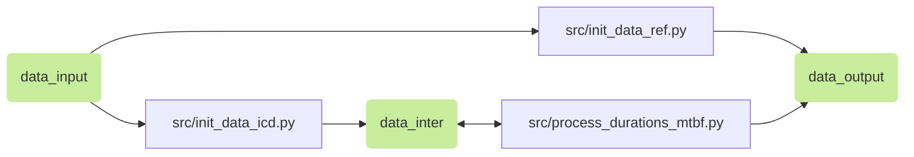

## Description

L'objectif de ce programme est de traiter les données d'incidents issues de BREHAT pour aboutir à des statistiques sur les temps entre incidents (précisément sur les durées entre date de début d'incident), sur plusieurs localisations et sur plusieurs infrastructures ferroviaires en Île-de-France.

Ce programme a été développé dans le cadre d'une mission au département Patrimoine, Exploitation et Projet de la Direction Générale de l'Île-de-France de SNCF Réseau.


## Exécution

### Installation de l'environnement virtuel et des dépendances

Une version de python >= 3.10 est requise.

```bash
    python -m venv .venv
    source .venv/bin/activate
    pip install -r requirements.txt
```

### Activation de l'environnement virtuel
```bash
    source .venv/bin/activate
```

### Exécution des tests unitaires
```bash
    pytest
```

### Exécution des scripts

Le point d'entrée principal du programme est la fonction ```main()```.

```bash
    python src/main.py
```


## Structure

### Dossiers des données

- *data_input* contient les données brutes des incidents (extractions manuelles de BREHAT, à ce jour il n'existe pas de flux automatiques pour ajouter des incidents à ce dossier), les données de référentiels sur les points remarquables (PR), les définitions des incidents ramenées à une infrastructure ferroviaire et les caractéristiques du réseau. Certains fichiers de référentiels doivent être mis à jour manuellement via des scripts présents dans le dossier *low_code* ;

- *data_inter* contient les données intermédiaires : les incidents traités (par infrastructure, sur un intervalle de temps choisi) et les durées entre incidents (au total ou par infrastructure, sur un intervalle de temps choisi) ;

- *data_output* contient les données finales : agrégations des données de durées entre incidents (au total ou par infrastructure, sur un intervalle de temps choisi).


### Traitement unique

#### Flux de données 



Les flèches désignent les flux d'import et d'export de données, qu'ils viennent d'un dossier ou d'un script. Les scripts intermédiaires (comme ```src/constants.py```, ```src/import_export.py```, ```src/logger.py```, ```src/clean.py``` ou ```src/matching.py```) ne sont pas représentés ici par souci de visibilité.

La fonction ```process()``` appelée dans le script ```src/main.py``` sert à exécuter ces traitements qui respectent les valeurs par défaut définis dans ```src/constants.py```. Il est aussi possible d'éxécuter indépendamment l'un des trois scripts présentés dans ce flux de données. L'ordre logique d'éxecution est : ```src/init_data_ref.py```, ```src/init_data_icd.py``` puis ```src/process_durations_mtbf.py```.


#### Valeurs par défaut

Le script ```src/constants.py``` regroupe les valeurs par défaut utiles à l'éxecution d'un traitement :


- les chemins et les noms des différents dossiers sont renseignés, comme *```logs_folder = "logs"```* ou *```output_folder = "data_output"```* (*str*);

- *```is_localization_simplified```* (*bool*) définit si la localisation des incidents est ramenée au PR de début (*```True```*, par défaut), ou si la localisation des incidents reste par arête selon un PR de début et un PR de fin (*```False```*).
Cela dépend du graphique qui est alimenté par les données produites.

- *```date_min```* et *```date_max```* (*datetime.date*) définissent l'intervalle de temps *```dates_itv```* (*tuple* de *list*) d'observation des incidents à traiter. L'éxecution de *```process()```* sans argument implique que les traitements soient sur un seul intervalle de temps, d'où l'appelation "traitement unique" ;

- il y a la possibilité de modifier certaines informations sur les PR avec *```PR_to_modify```* (*dict*) et d'ajouter des libellés de PR avec *```PR_to_add```* (*dict*) pour faciliter l'étape matching. *```PR_to_modify```* et de *```PR_to_add```* permettent aussi de retracer les modifications et les ajouts d'informations sur les PR par rapport aux données initiales ;

- les données sont stockées dans des fichiers *.csv* dont l'encodage est défini par *```encoding = "utf-16"```* et le séparateur est défini par *```sep = "\t"```* ;

- enfin il y a des informations sur des noms de fichiers et des noms des colonnes, qu'il vaut mieux laisser telles quelles.

Ce sont ces valeurs par défaut dans ```src/constants.py``` qui sont prises lors de l'appel de ```process()```. 
Les valeurs susceptibles d'être modifiés ici sont *```is_localization_simplified```*, *```date_min```* et *```date_max```*.


### Traitement multiple

L'objectif de ces traitements étant d'alimenter des rapports PowerBI (présents dans le dossier *plots*), la fonction *```process()```* peut prendre en argument d'autres valeurs que celles renseignées dans ```src/constants.py```. Dans ce cas, les valeurs renseignées en argument écrasent les valeurs par défaut de ```src/constants.py```.

Les arguments à utiliser dans *```process()```* sont : *```output_folder```*, *```is_localization_simplified```* et *```dates_itv```*. Ajouter d'autres arguments n'aura aucun effet sur les résultats.

L'appel de *```process(output_folder, is_localization_simplified, dates_itv)```* avec des arguments différents de ceux par défaut, ne peut se faire que dans ```src/main.py```, ou encore dans un nouveau script. Des fonctions personnalisées qui l'appellent sont définies dans ```src/main.py```.

L'appelation "traitement multiple" vient du fait que *```dates_itv```* contient plusieurs intervalles de temps d'observations des incidents, et qu'un "traitement unique" est appliqué sur chacun de ces intervalles. Le flux de donnée est donc celui du traitement unique mais répété autant de fois qu'il y a d'intervalles définis. Une parallélisation de la boucle présente dans fonction *```multi_process()```* venant du script ```src/process.py``` est envisageable. 


### Données de sorties

L'objectif du programme est de générer trois fichiers de données présentés ci-dessous. 

- *referentiel_pr* constitue les informations de référence sur les PR. 
  La clef primaire est définie par les colonnes *pr_ref* et *code_ligne*.


| Colonne          | Description                                                                                                     |
| :--------------- | :-------------------------------------------------------------------------------------------------------------- |
| pr_ref           | Libellé du PR.                                                                                                  |
| code_ligne       | Numéro de ligne passant par le PR.                                                                              |
| pr_              | Libellé non standard du PR, utile à l'étape de matching avec les PR venant des données initiales des incidents. |
| pk               | Point kilométrique.                                                                                             |
| latitude         | Latitude (Y).                                                                                                   |
| longitude        | Longitude (X).                                                                                                  |
| en_idf           | Indique si le PR a lieu en Île-de-France.                                                                       |
| densite          | Fréquence de circulation lié au tonnage.                                                                        |
| uic              | Fréquence de circulation.                                                                                       |
| infrapole        | Infrapole.                                                                                                      |
| ligne_transilien | Ligne.                                                                                                          |


- *mtbf_infra* regroupe des statistiques sur les incidents et les temps entre incidents pour un périmètre donné : sur un lieu (défini par *pr_debut_ref* et *pr_fin_ref*), sur un intervalle de temps  (défini par *itv_min* et *itv_max*) et sur une infrastructure (définie par *infra*).
  
  La clef primaire est définie par les colonnes *pr_debut_ref*, *pr_fin_ref*, *infra*, *itv_min* et *itv_max* (si *```is_localization_simplified```* est *False*, sans *pr_fin_ref* si *```is_localization_simplified```* est *True*).
  

| Colonne                     | Description                                                                                                                                                          |
| :-------------------------- | :------------------------------------------------------------------------------------------------------------------------------------------------------------------- |
| pr_debut_ref                | Libellé du PR de début. Il est relié à un *pr_ref* venant de *referentiel_pr*.                                                                                       |
| pr_fin_ref                  | Libellé du PR de début. Il est relié à un *pr_ref* venant de *referentiel_pr*.                                                                                       |
| liste_code_ligne            | Numéros des lignes présentes entre le PR de début et le PR de fin. Il vaut 0 si le PR de début et le PR de fin sont identiques (*i.e.* incidents sur le lieu du PR). |
| infra                       | Infrastructure ferroviaire concernée.                                                                                                                                |
| itv_min                     | Borne inférieure de l'intervalle de temps d'observation des incidents.                                                                                               |
| itv_max                     | Borne supérieure de l'intervalle de temps d'observation des incidents.                                                                                               |
| nombre_icd                  | Nombre cumulé d'incidents.                                                                                                                                           |
| ratio_itv_sur_nbicd         | Ratio entre le nombre de jours dans l'intervalle de temps d'observation des incidents et le nombre d'incident auquel on ajoute 1 (pour éviter une division par 0).                                    |
| minimum_tbf                 | Temps minimal entre incidents.                                                                                                                                       |
| mediane_tbf                 | Temps médian entre incidents.                                                                                                                                        |
| maximum_tbf                 | Temps maximal entre incidents.                                                                                                                                       |
| nombre_perturbations_trains | Nombre cumulé de trains perturbés.                                                                                                                                          |
| nombre_suppressions_trains  | Nombre cumulé de trains supprimés.                                                                                                                                          |
| nombre_minutes_perdues      | Nombre cumulé de minutes perdues.                                                                                                                                           |


- *mtbf_tot* contient les mêmes colonnes que *mtbf_infra* sauf la colonne *infra*. Les incidents ne sont pas associés à une infrastructure et les temps entre incidents sont calculés pour toutes les infrastructures confondues. Le périmètre est donc uniquement spatiale et temporelle.

  La clef primaire est définie par les colonnes *pr_debut_ref*, *pr_fin_ref*, *itv_min* et *itv_max* (si *```is_localization_simplified```* est *False*, sans *pr_fin_ref* si *```is_localization_simplified```* est *True*)

Les deux derniers fichiers générés après un traitement multiple sont intitulés *mtbf_infra_itv* et *mtbf_tot_itv*. 


### Rapports PowerBI

Trois traitements sont effectués pour chacun des rapports PowerBI. Chaque puce ci-dessus informe sur les valeurs prises dans la fonction *```process(output_folder, is_localization_simplified, dates_itv)```* et sur la portée des rapports PowerBI.

- Le rapport n°1 porte sur les incidents selon l'année et sur les incidents selon les périodes printemps+été ou automne+hiver. Les incidents sont ramenés à leur PR de début. Les données sont stockées dans *data_output1*.
  
- Le rapport n°2 porte sur les incidents et le vieillissement selon l'année. Les incidents sont ramenés à leur PR de début. Les données sont stockées dans *data_output2*.

- Le rapport n°3 porte sur le vieillissement auquel on a réuni les informations sur les incidents, selon l'année. Les incidents ne sont pas ramenés à leur PR de début. Les données sont stockées dans *data_output3*. 

  Le script ```src/merge_mtbf_to_icv.py``` sert à faire la jointure des données d'incident vers les données de vieillissement.

Le dossier *data_input_icv* contient les données de vieillissement qui sont utilisées dans les 2 derniers rapports. Elles sont considérées comme externes au programme puisque ce-dernier traite uniquement des incidents. Elles doivent néanmoins respecter certains standards (voir les tests unitaires).

### Dossier *low_code*

Ce dossier contient des scripts indépendants des traitements décrits ci-dessus, mais qui génèrent des données utiles notamment pour les visualisations.

- ```low_code/init_triplets_uniques.py``` génère le fichier *triplets_uniques* dans *data_input* qui sert à construire la classification des incidents dans le fichier *referentiel_definition_incident* du même dossier. Une nouvelle définition d'incident, *i.e.* un triplet non connu, peut apparaître et il convient de le rajouter dans *referentiel_definition_incident* en lui associant une infrastructure. Ce script ne peut pas être éxecuté automatiquement puisque l'association (ou la classification) d'un triplet définissant un incident avec une infrastructure ferroviaire est manuelle. Un test unitaire permet de vérifier que les triplets présents dans les données d'incidents apparaîssent bel et bien dans *referentiel_definition_incident*.

- ```low_code/init_referentiel_gps.py``` génère le fichier *referentiel_gps* dans les dossiers *data_output1* et *data_output2*, respectivement associés aux rapports n°1 et n°2. Dans *data_output1*, ces données regroupent les coordonnées GPS uniques des PR. Dans *data_output2*, ces données regroupent les coordonnées GPS uniques des PR et des infrastructures. Il convient d'éxecuter ce script si de nouveaux PR ou de nouvelles infrastructures sont ajoutées.

- ```low_code/init_referentiel_reseau.py``` génère les fichiers suivants dans le dossier *data_output2* : *referentiel_infrapole*, *referentiel_uic*, *referentiel_densite*, *referentiel_ligne* et *referentiel_codeligne*. Ces données servent à mutualiser les filtres entre les données d'incidents et les données de vieillissement du rapport n°2. Il convient de modifier et d'éxecuter ce script si de nouvelles données sur les infrapoles, les UIC, les densités, les lignes ou les codes lignes sont ajoutées.

- ```low_code/init_referentiel_temps.py``` génère *referentiel_temps1* et *referentiel_temps2* dans *data_output1* (qui regroupent respectivement les années et les saisons printemps+été et automne+hiver), génère *referentiel_annee* dans *data_output2* (qui regroupe les années) et génère *referentiel_temps* (qui regroupe aussi les années) dans *data_output3*. Chacun de ces fichiers sont utiles à un rapport concernant les filtres sur les intervalles de temps d'observation des incidents. Il convient de modifier et d'éxecuter ce script si les dates d'incidents dépassent les intervalles de temps définies dans ces référentiels.
